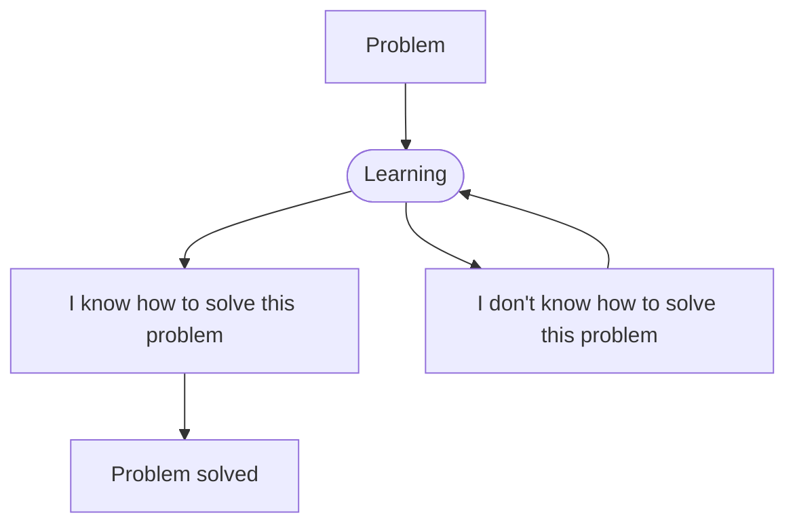

# Hi, I'm Bartosz!

I'm a student at **Warsaw University of Technology**. I am interested in entrepreneurship and technology, and I would like to continue developing my skills in these areas. 
- I’m currently learning backend (mostly)
- I’m learning: *Java ♨️, Spring Boot 🚀, REST API 🌐, MongoDB & MySQL 🔍, Docker 🐳, Linux 🐧*
- How to contact with me:📩  ryfabartosz@protonmail.com
- I'm 🍎 ecosystem fan

  **I'd describe myself as:**
 - [x] Empathy
 - [x] Teamwork
 - [x]  easy-going
 - [x] Problem Solving
 - [x] Open - mindedness
 - [x] Team and Time Management
 - [x] Logical and Analytical Thinking

## My learning through practice

## My current Stack:
- Java ♨️
- Spring Boot 🚀
- SQL 🔍
- HTML 5
- CSS
  
## Connect with me:

